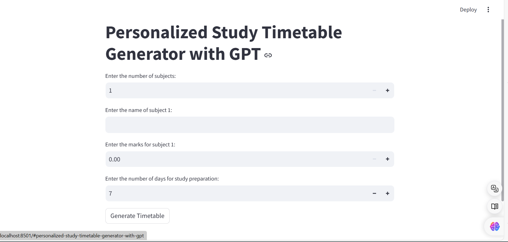
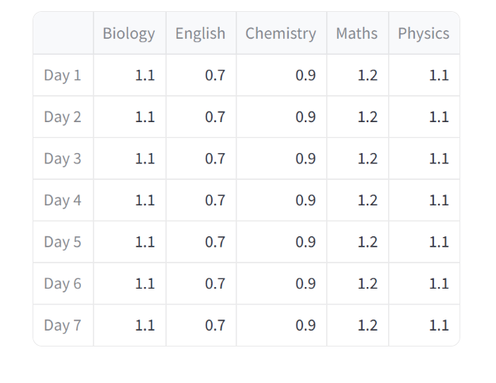

TASK MANAGER
---

Introducing your ultimate companion for academic success: the Task Manager 2.0! Say goodbye to endless hours of planning and hello to optimized study schedules tailored just for you. Whether you're a student juggling multiple subjects or a lifelong learner diving into new knowledge realms, Task Manager 2.0 has got your back.At its core, Task Manager 2.0 is a dynamic tool designed to streamline your study process. Gone are the days of staring blankly at your to-do list, wondering where to begin. With Task Manager 2.0, you simply input the number of subjects you're tackling, along with their names, scores, and the number of days you have to prepare. From there, sit back and watch as the magic unfolds.Powered by GPT-2.0, Task Manager 2.0 takes your input and transforms it into a meticulously crafted timetable optimized for maximum efficiency. No more wasted time or energy on ineffective study sessions. Each schedule is intelligently designed to prioritize tasks based on subject difficulty, time constraints, and your personal learning style. Whether you thrive on intense cram sessions or prefer spaced-out study intervals, Task Manager 2.0 tailors the timetable to suit your needs.
  
But Task Manager 2.0 is more than just a scheduling tool—it's your virtual study companion. With its sleek and user-friendly interface built on Streamlit, navigating through your customized timetable is a breeze. Say goodbye to clunky spreadsheets and hello to intuitive, visually appealing displays that make studying a pleasure rather than a chore.What sets Task Manager 2.0 apart is its adaptability. As your study goals evolve, so too does your timetable. Whether you need to adjust your schedule to accommodate new deadlines or add additional subjects on the fly, Task Manager 2.0 seamlessly adapts to your changing needs. With real-time updates and intelligent recommendations, staying on track has never been easier.But perhaps the most remarkable feature of Task Manager 2.0 is its ability to foster a sense of balance and well-being amidst the chaos of academic life. By optimizing your study schedule, Task Manager 2.0 frees up precious time for relaxation, socializing, and self-care. Gone are the days of burning the midnight oil or sacrificing sleep for the sake of productivity. With Task Manager 2.0, you can achieve academic success without sacrificing your mental and physical health.In a world where time is our most precious resource, Task Manager 2.0 empowers you to make the most of every moment. Say goodbye to stress and hello to productivity, efficiency, and success. Try Task Manager 2.0 today and experience the difference for yourself. Your academic journey starts here.
  
  
  

   <h1> <b>SNAPSHOTS</b> </h1>
      
    
    
    

